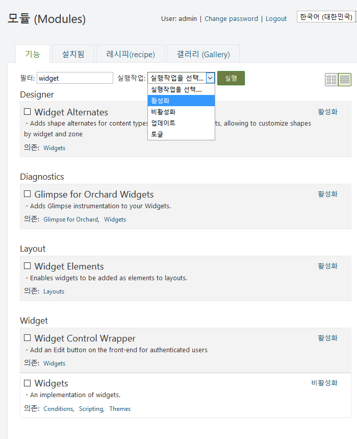
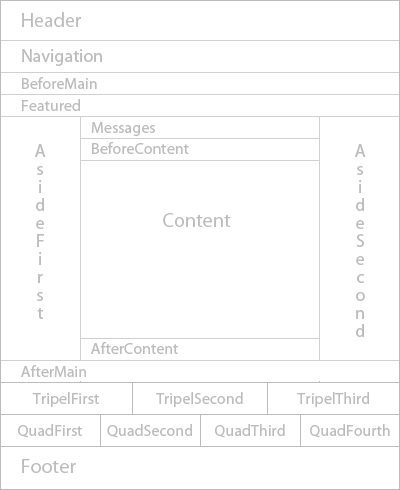

## me2 File Field

파일 필드는 me2.DownloadsCounter 와 함께 각종 미디어파일및 각종 파일을 파일보기및 다운로드 할 수 있는 파일 첨부 기능을 지원 합니다

Name: me2 File Field
AntiForgery: enabled
Author: John Murdoch / lims
Website: http://anys4u.com/
Version: 1.0.0
OrchardVersion: 1.10
Description: The file field adds the ability to link/attach files for download i.e. PDF, Word Docs
Features:
    me2.FileField:
		Name: me2 File Field
        Description: The File Field.
		Category: Fields
		Dependencies: Settings, me2.DownloadsCounter
		
**필수(종속) 모듈**
- Orchard.Fields : Input, Boolean, DateTime, Numeric, Link, Enumeration(열거용) 등의 필드를 포함합니다.
- Orchard.Tokens : 공통 사이트 값으로 문자열 바꾸어주는 작업 시스템을 제공합니다.
- Orchard.Workflows : 사용자를 지정하여 작업흐름(워크 플로)을 만드는 도구를 제공합니다.
- Orchard.Resources : 다른 모듈에서 사용하는 다양한 타사 클라이언트 측 라이브러리 (stylesheets and scripts - 스타일 시트 및 스크립트)를 제공합니다.

		

> **<i class="fa fa-info-circle"></i> 사용하기:** 모듈릏 사용 하려면 <u>활성화</u> 링크를 클릭하거나 체크한후 실행작업 콤보에서 활성화를 선택하고 버튼을 클릭 합니다.

### 파일 필드 사용하기 (Using the Field)

새 필드를 사용하려면 먼저 해당 Orchard.ContentTypes기능이 활성화되어 있는지 확인해야합니다 . 또한 새로운 DateTimeField기능을 사용할 수 Fields있습니다. 그런 다음 관리자 메뉴에서 컨텐츠 유형 관리를 클릭 할 수 있습니다 . Create new type을 클릭 하고 "Event"라는 이름을 지정하십시오. 필드 옆의 추가를 클릭 하고 필드 이름으로 "언제"를 입력하십시오. DateTime필드 유형으로 새 필드 유형을 선택하십시오 .

이제 타입 에디터에서 새로운 When필드를 볼 수 있으며 왼쪽 의 " > "를 클릭하여 설정 섹션을 배치 할 수 있습니다 .

**<i class="fa fa-file-text-o"></i> 레이아웃**
Zones: Header, Navigation, BeforeMain, Featured, AsideFirst, Messages, BeforeContent, Content, AfterContent, AsideSecond, AfterMain, TripelFirst, TripelSecond, TripelThird, FooterQuadFirst, FooterQuadSecond, FooterQuadThird, FooterQuadFourth, Footer

### 파일 필드 지원 (Support)

문제가 있으면 알려 주시기 바랍니다.
다음 주소에 메일 링리스트가 있습니다. project@google-groups.com

* 개발자 (Author)

	- lims
	- http://anys4u.com
	- Version: 1.0.0

* 기부 (Contribute)

	- 이슈 트래커 : 
	- 소스 코드 : 

* 설치 (Installation)

	<i class="fa fa-link"></i> [ 테마관리에서 적용 방법](../inx1-themes.html#managing-themes)을 알아 보십시오.

	<i class="fa fa-download"></i> [ 소스 다운로드](http://anys4u.com) http://anys4u.com 에서 다운로드 합니다.

* 라이센스 (License)

  이 프로젝트는 BSD 라이센스에 따라 라이센스가 부여됩니다.

