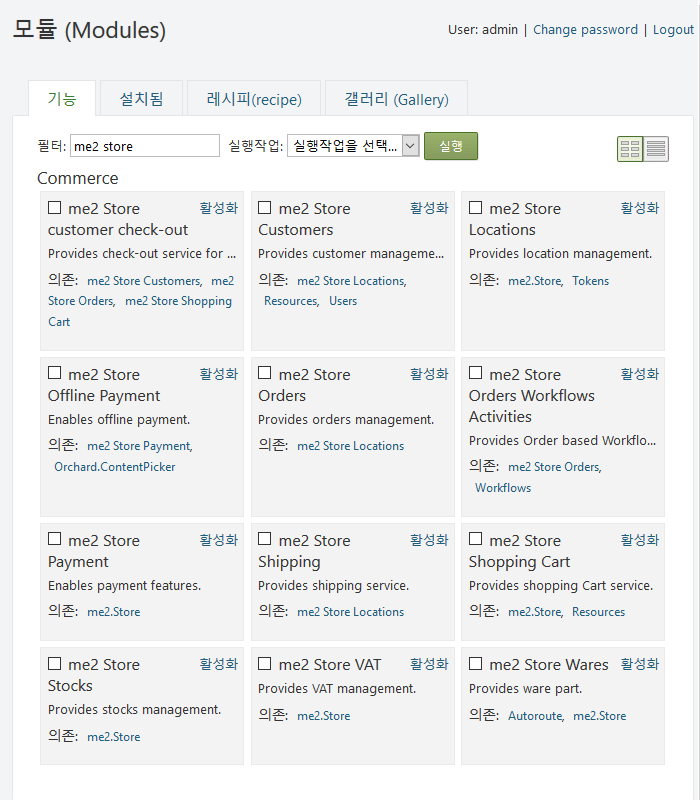

## me2 Store

Store(가게)는 오차드 CMS용 전자 상거래  모듈입니다.

[OShop](https://github.com/OShop/OShop) 패케지 소스를 다운로드 상품및 정량 상품을 적용 하기 위해 수정한 오차드 CMS용 모듈 입니다    

**종속 모듈**
- Orchard.Fields : Input, Boolean, DateTime, Numeric, Link, Enumeration(열거용) 등의 필드를 포함합니다.
- Orchard.Tokens : 공통 사이트 값으로 문자열 바꾸어주는 작업 시스템을 제공합니다.
- Orchard.Workflows : 사용자를 지정하여 작업흐름(워크 플로)을 만드는 도구를 제공합니다.
- Orchard.Resources : 다른 모듈에서 사용하는 다양한 타사 클라이언트 측 라이브러리 (stylesheets and scripts - 스타일 시트 및 스크립트)를 제공합니다.

### 가게 모듈 기능 -Store Features

* me2.Store.Wares: 상품파트를 제공하며 사용하기위해서는 콘텐츠 형식을 먼저 생성하고 Ware파트를 추가 합니다.

* me2.Store.Stocks: 재고관리 제공

* me2.Store.VAT: 부가가치세 관리 제공

* me2.Store.ShoppingCart: 장바구니 서비스 제공

* me2.Store.Locations: 위치(로컬 지역) 관리를 제공

* me2.Store.Shipping: 배송 서비스를 제공

* me2.Store.Customers: 고객관리 제공

* me2.Store.Checkout: 고객용 체크 아웃 서비스를 제공

* me2.Store.Orders: 주문관리 제공

* me2.Store.Orders.Workflows: 주문 기반 작업흐름(워크 플로우) 작동 제공

* me2.Store.Payment: 결제 기능 사용 설정

* me2.Store.OfflinePayment: 오프라인 지불 기능 활성화

> **<i class="fa fa-info-circle"></i> 사용하기:** 모듈릏 사용 하려면 <u>활성화</u> 링크를 클릭하거나 체크한후 실행작업 콤보에서 활성화를 선택하고 버튼을 클릭 합니다.

### 가게 모듈 설치 (Using the Field)

#### 가게 모듈 지원 (Store Module Support)

문제가 있으면 알려 주시기 바랍니다.
다음 주소에 메일 링리스트가 있습니다. project@google-groups.com

* 개발자 (Author)

  Author: Codinlab / Lims
  Website:  https://github.com/OShop/OShop / http://anys4u.com
  Version: 1.0
  OrchardVersion: 1.10
  Category: Commerce

* 기부 (Contribute)

* 설치 (Installation)

	<i class="fa fa-link"></i> [ 모듈 기능 활성화 방법](../inx2-modules.html#module-features)을 알아 보십시오.

	<i class="fa fa-download"></i> [ 소스 다운로드](http://anys4u.com) http://anys4u.com 에서 다운로드 합니다.

* 라이센스 (License)

  이 프로젝트는 BSD 라이센스에 따라 라이센스가 부여됩니다.

### OShop

E-commerce module for Orchard CMS.

> Name: OShop
> AntiForgery: enabled
> Author: Codinlab
> Website: https://github.com/OShop/OShop
> Version: 1.0
> OrchardVersion: 1.10
> Category: Commerce

