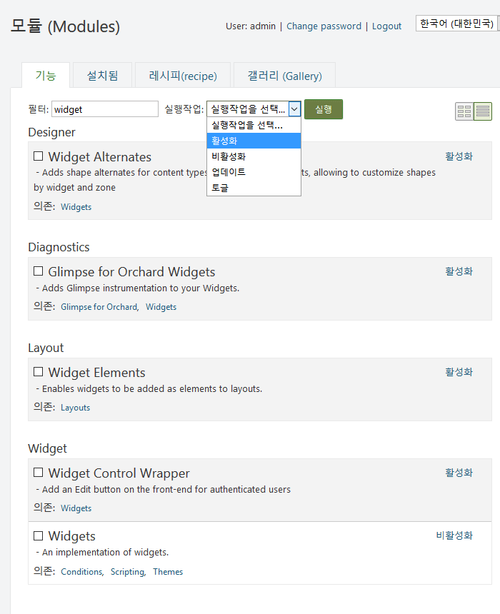
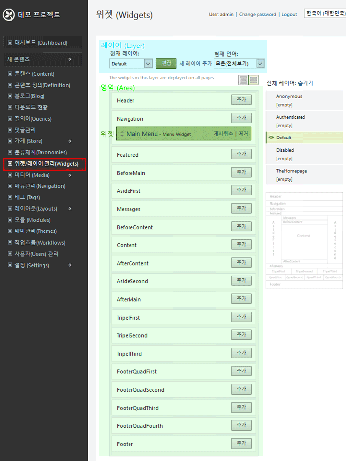
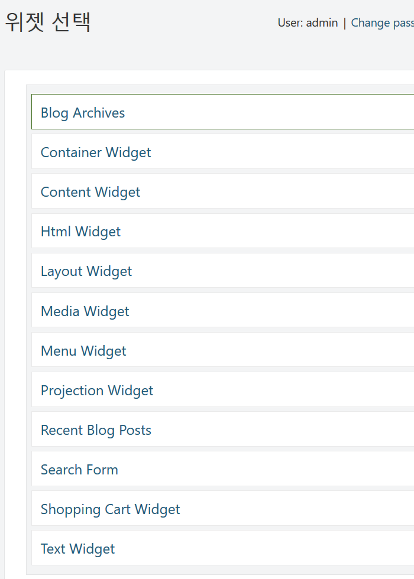
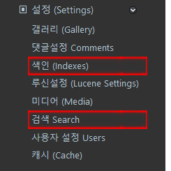
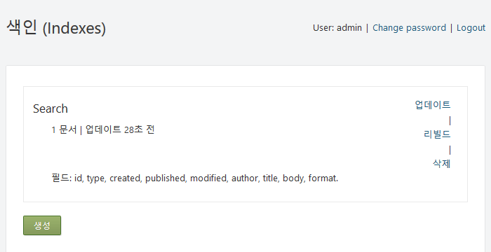
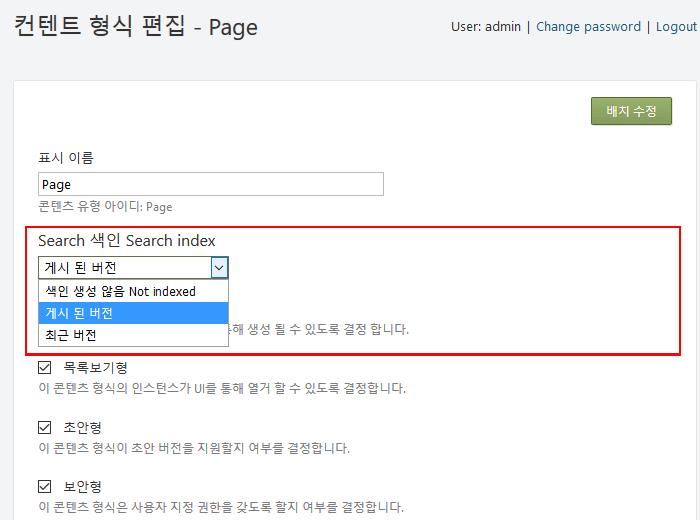
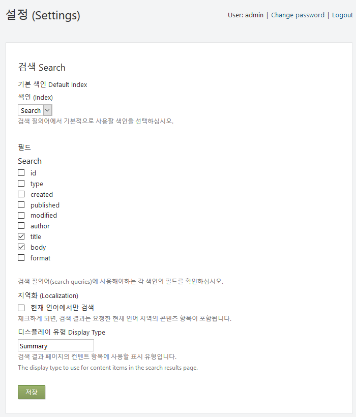

## 위젯 -Widgets

Orchard에서 위젯은 사이드 바 또는 머릿글,바닥 글 영역에서 매핑 될 수있는 UI(사용자 인터페이스) 및 코드(콘텐츠 파트)의 일부입니다.
 위젯의 예로 탐색 메뉴, 이미지 갤러리, 검섹 양식, 비디오 및 태그 클라우드(Tag Cloud)가 있습니다.

**종속 모듈**
- Orchard.Conditions : true 또는 false로 평가되는 규칙 API를 제공
- Orchard.Scripting : 간단한 사용자 정의 스크립팅 언어를 사용하여 스크립트를 실행도록 지원.
- Orchard.Themes : 웹 사이트의 모양(Shape)과 느낌(feel)을 사용자 정의 할 수 있습니다.

### 위젯 모듈 기능 -Widget module feature

* Orchard.Widgets.PageLayerHinting: 직접 링크가있는 새 페이지를 만든 후 URL을 사용하여 특정 페이지의 위젯 레이어를 만드는 알림(설명)을 추가합니다.
> 이름: Page Layer Hinting
> 의존: Orchard.Widgets
* Orchard.Widgets.ControlWrapper: 인증 된 사용자를 위해 프런트 엔드에 수정 버튼 추가
> 이름: Widget Control Wrapper
> 의존: Orchard.Widgets
* Orchard.Widgets.Elements: 위젯을 레이아웃 요소로 추가 할 수 있습니다.
> 이름: Widget Elements
> 의존: Orchard.Layouts

	
	

> **<i class="fa fa-info-circle"></i> 사용하기:** 모듈릏 사용 하려면 <u>활성화</u> 링크를 클릭하거나 체크한후 실행작업 콤보에서 활성화를 선택하고 버튼을 클릭 합니다.

### 사용 가능한 위젯  -Available Widgets

Orchard는 대시 보드의 모듈(Modules) 화면에서 기능(Features) 탭의 모듈(기능)를 활성화하여 위젯을 사용할 수 있게 될 때마다 현재 테마의 영역에 추가 할 수 있는 사용 가능한 위젯(Widget) 목록에 추가 시킵니다. 사용 가능한 위젯 목록을 보려면 대시보드 메뉴에서  **위젯/레이어 관리(Widgets)** 를 클릭하고  위젯(Widget)화면에 나열된 영역 중 하나 에서 추가 버튼을 클릭합니다 .

예를 들어 위젯 화면 에서 AsideSecond(오른쪽 영영임)영역의 추가버튼을  클릭 합니다. 사용 가능한 위젯 중 하나를 선택할 수있는 **위젯 선택** 화면이 표시됩니다.

다음 표는 오차드에서 기본적으로 사용할 수 있는 위젯을 설명합니다. 

위젯   Widget            | 설명 Description
--------------------- | ------------------------------------------------------------------
**Blog Archives**     | 지정된 블로그에 대한 글 보관함 목록을 표시합니다.
**Container Widget**  | 목록과 같은 "포함 된" 콘텐츠 항목을 표시합니다.
**Html Widget**       | 위젯 편집기를 사용하여 입력 한 HTML 콘텐츠를 표시합니다.
**Recent Blog Posts** | 지정된 블로그의 최근 게시물 목록을 표시합니다.

> Search 검색 레시피 함목에서 <u>실행</u> 링크을 클릭하여 성공적으로 설치 되면
 Lucene 엔진을 사용하여 기본 검색 색인(indexes) 및 검색(search) 설정이 자동 구성 됩니다.

 

검색(Search) 모듈은 색인(index) 생성에 의존하므로 검색모듈을 사용하면 자동으로 색인 생성도 가능합니다. 검색 및 인덱싱이 작동하려면 Lucene도 활성화 돼야 하며 자동으로 활성화 됩니다. 

### 레이어 목록 (Recipe Search Result)
 
 
> Search(검색) , Indexinf(색인), Lucene(루신) 모듈이 활성화 되어 콘텐츠 형식(Content Type)에서  Search 색인을 편집(설정)할 수 있습니다.
 
 
### 영역 목록 - Index Search Content

**

대시보드(Dashboard)로 이동하고 모듈(Modules)를 클릭하고 **설정(Setting)** 메뉴를 펼칩니다.

Indexing(색인) 모듈을 활성화 하면 대시 보드의 설정 섹션(왼쪽 그림 참조)에서 새로운 검색 및 색인 항목을 사용할 수있게됩니다. 

  

 
> 색인(index)는 기본적으로 1 분에 한 번 백그라운드 작업으로 실행되며 이 화면에서 인덱스를 선택적으로 업데이트하거나 리빌드 할 수 있습니다.  
인덱스는 또한 문서의 갯수와 검색 화면 인덱스 필드를 함께 표시합니다.
 
대시보드 (Dashboard)에서 콘텐츠 정의(Definition)를 클릭하고 콘텐츠 타입(Types) 탭을 누르면 콘텐츠 형식을 관리할 수 있습니다.
 
 
> **Search 색인** 에서 검색질의(query)에 포함 방법을 선택 합니다. 
> * 색인생성 않음 : 인덱싱되지 않은 유형의 항목은 건너 뛰기 합니다.
> * 게시된 버전 : 게시된 콘텐츠  
> * 최근 버전 :  최근 게시된 문서 색인 추출

검색(Search) 모듈 기능이 활성화 되면 대시 보드의 설정 화면에 색인에 검색질의할(queried) 필드(**검색 Search** 화면에 나열 됨)가 표시됩니다. 
 
 
 
 
 
 
 
#### 위젯 지원 (Support Widget)

문제가 있으면 알려 주시기 바랍니다.
다음 주소에 메일 링리스트가 있습니다. project@google-groups.com

* 개발자 (Author)

	- Name: Widgetsabled
	- Author: The Orchard Team
	- Website: http://orchardproject.net
	- Version: 1.10.2
	- OrchardVersion: 1.9
	- Description: An implementation of widgets for Orchard.
	- FeatureDescription: An implementation of widgets.
	- Category: Widget

* 기부 (Contribute)

	- 이슈 트래커 : 
	- 소스 코드 : 

* 설치 (Installation)

	<i class="fa fa-link"></i> [ 모듈 기능 활성화 방법](../inx2-modules.html#module-features)을 알아 보십시오.

* 라이센스 (License)

  <del>이 프로젝트는 BSD 라이센스에 따라 라이센스가 부여됩니다.</del>

