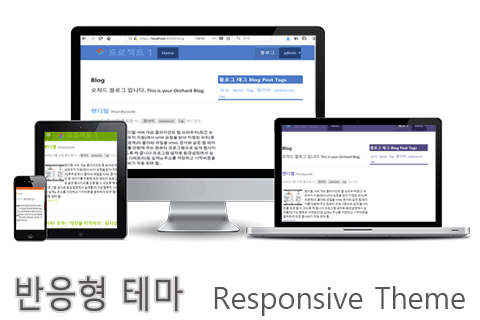
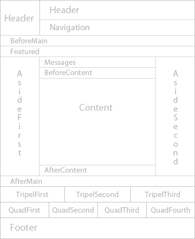

## The Responsive Theme

반응형 테마는 스마트 폰, 타블렛, 노트북 및 데스크 탑 장치에서 적용 되는 Orchard CMS 스킨 패케이지 입니다.

> **<i class="fa fa-exclamation-triangle" aria-hidden="true"></i> 주의:** 이 구문은 마크다운 인용구 문법 입니다.

### 기능 (Features)

**<i class="fa fa-file-text-o"></i> 레이아웃**
Zones: Header, Navigation, BeforeMain, Featured, AsideFirst, Messages, BeforeContent, Content, AfterContent, AsideSecond, AfterMain, TripelFirst, TripelSecond, TripelThird, FooterQuadFirst, FooterQuadSecond, FooterQuadThird, FooterQuadFourth, Footer

### 지원 (Support)

문제가 있으면 알려 주시기 바랍니다.
다음 주소에 메일 링리스트가 있습니다. project@google-groups.com

#### 개발자 (Author)

- lims
- http://anys4u.com
- Version: 1.0.0

#### 기부 (Contribute)

- 이슈 트래커 : 
- 소스 코드 : 

#### 설치 (Installation)

<i class="fa fa-link"></i> [ 테마관리에서 적용 방법](../inx1-themes.html#managing-themes)을 알아 보십시오.

<i class="fa fa-download"></i> [ 소스 다운로드](http://anys4u.com) http://anys4u.com 에서 다운로드 합니다.

#### 라이센스 (License)

이 프로젝트는 BSD 라이센스에 따라 라이센스가 부여됩니다.

